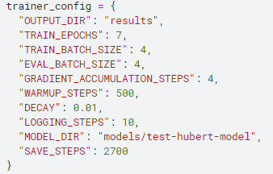
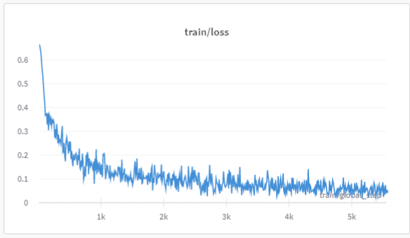
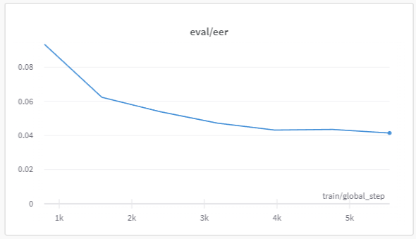
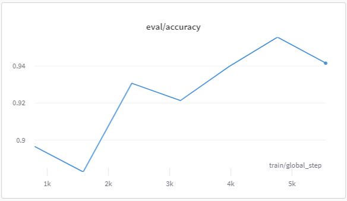
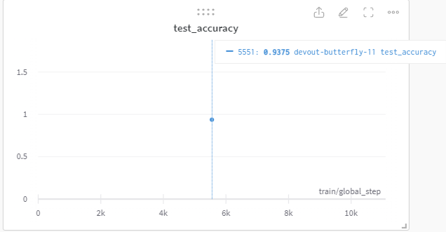
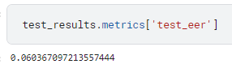

**AVspoof2019**

For this challenge, I chose to employ the Hubert model, a high-performing architecture for voice tasks, and fine-tune it on the AVspoof2019 dataset using transfer learning. The model was trained for seven epochs with the following configuration:

During training, we observed the following loss pattern:

We witnessed a significant decrease in EER from 9.3% to 4.1% on the validation set, indicating an improvement in performance. Additionally, the model achieved approximately 95% accuracy.

 

On the test set, the model demonstrated a 93.3% accuracy and a 6% EER.

While further fine-tuning and improvements can be made to enhance the model's performance, the current results show promise and a solid foundation for further development.

**How to run**

1.Build the Docker image:
docker build -t spoof-project .

2.Run the Docker container:
docker run -p 8888:8888 spoof-project 

3.Sign up for a Weights & Biases account to enable model tracking:

[Visit Weights & Biases](https://wandb.ai/site)

Create a new user account or sign in with an existing one

4.When prompted in the notebook, enter your Weights & Biases API key:
Find your API key in your W&B account settings
Copy the API key and paste it into the notebook input field when prompted

5.Update the relevant variables to reflect the correct file paths, replacing the default Kaggle paths as necessary.

